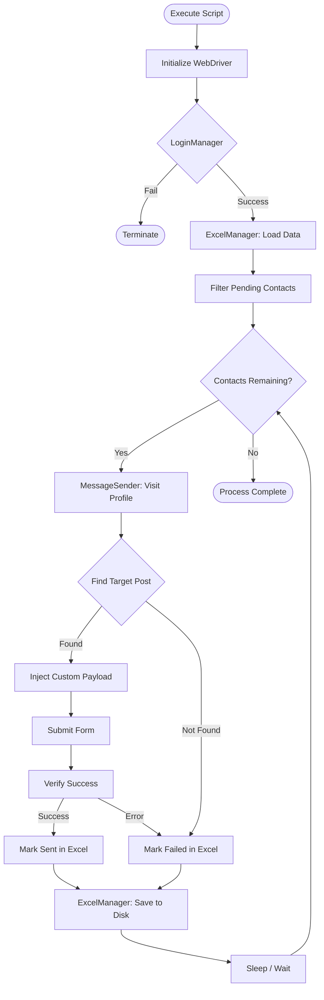

# Architecture Documentation

## Core Components

The **OutLawZ DamaDam Auto Message Sender** is structured into distinct functional classes that handle discrete parts of the automation pipeline.

### 1. Main Controller (`main`)
- Initializes configurations and sets up the Selenium Chrome WebDriver.
- Coordinates the interactions between `LoginManager`, `ExcelManager`, and `MessageSender`.
- Manages the looping logic over the targeted slice of the pandas DataFrame.

### 2. LoginManager
- Responsible exclusively for authenticating the session.
- Locates the login form, injects credentials, and verifies authentication success by checking the resulting URL.

### 3. ExcelManager
- Wraps the `pandas` and `openpyxl` interactions.
- Responsible for parsing `Final_Cleaned.xlsx` into memory.
- Performs atomic status updates to the dataframe.
- Commits changes back to the filesystem.

### 4. MessageSender
- Traverses a user's profile URL.
- Identifies an interactable post and transitions to it.
- Resolves complex DOM interactions, specifically targeting React virtual DOM components.
- Injects a personalized string payload and submits the comment form.

## Data Flow Diagram

## Storage

State persistence is maintained entirely via a local spreadsheet:
- **`Final_Cleaned.xlsx`**: Serves as both the input database and the persistent state tracker. By reading `NaN` or empty strings in the `Status` column, the script automatically resumes where it previously left off.

---

## 👨‍💻 Credits

**By OutLawZ™**

Website: https://www.brandex.pk

Need custom automation, AI tools, workflow systems, dashboards, integrations, scraping tools, content automation, or business process automation?

Contact:

📧 Email: net2tara@gmail.com
🌐 Website: https://www.brandex.pk
📘 Facebook: Coming Soon
📸 Instagram: Coming Soon
▶️ YouTube: Coming Soon

---
Made with ❤️ by OutLawZ™
