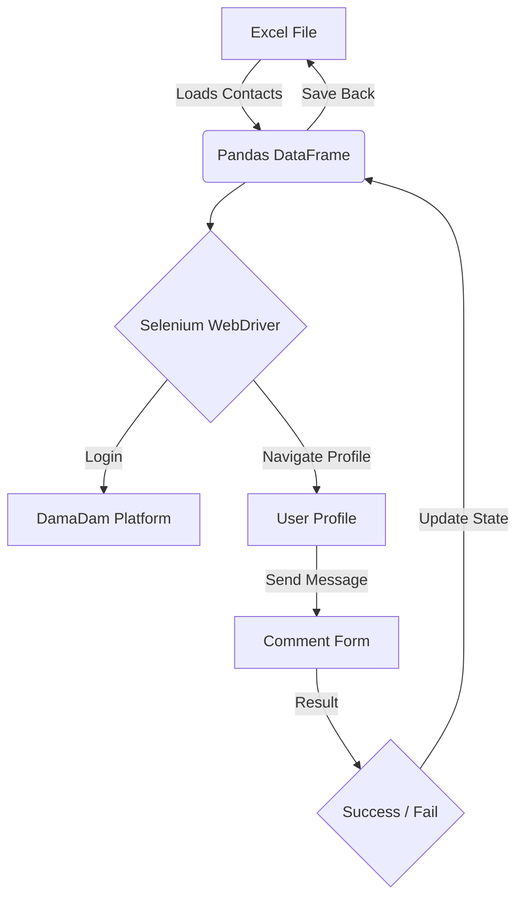
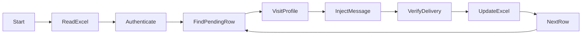

# 🎬 OutLawZ DamaDam Auto Message Sender (Simplified)

---

# Description

The **OutLawZ DamaDam Auto Message Sender** is an automated web scraping and messaging utility designed to interact with the DamaDam social platform. It leverages Selenium WebDriver to automatically log into the platform, read a targeted list of users from an Excel spreadsheet (`Final_Cleaned.xlsx`), and sequentially send personalized direct messages. It features automatic error handling for React-powered interfaces and updates the success/failure status of each message attempt back into the Excel spreadsheet for robust tracking.

---

# 🚀 Features

- **Automated Login:** Securely authenticates into the DamaDam platform.
- **Excel Integration:** Reads contact data and outputs execution status directly to `.xlsx` files using `pandas` and `openpyxl`.
- **Targeted Messaging:** Traverses target profiles and accurately detects comment/messaging forms.
- **React-Compatible Input Handling:** Specifically designed to bypass strict React-driven textarea components using Javascript event dispatching.
- **State Persistence:** Records "Sent" or "Failed" statuses natively into the source Excel file for progress tracking.
- **Rate Limiting & Delays:** Built-in configurable delays between requests to prevent temporary bans or blocks.

---

# 🛠️ Tech Stack

| Layer | Technology |
| --- | --- |
| **Language** | Python 3.x |
| **Automation** | Selenium WebDriver |
| **Data Processing** | Pandas, Openpyxl |
| **Data Source** | Excel (.xlsx) |

---

# 📂 Project Structure

```text
Bookmark/
├── DD-Msg-Bot/             # Older or related bot files
├── Final_Cleaned.xlsx      # Input database and state tracker
├── dd_msg_sender.py        # Main execution script
└── README.md               # Documentation
```

---

# 📄 Important Files

| File | Purpose |
| --- | --- |
| `dd_msg_sender.py` | Main execution entry point containing the Bot logic. |
| `Final_Cleaned.xlsx`| Target list containing Names, URLs, and tracking Status. |

---

# 🏗️ Architecture Diagram



---

# 🔄 Processing / Data Flow



---

# 📥 Inputs

- **`Final_Cleaned.xlsx`**: Requires columns `Name`, `City`, `URL`, `Status`, `Notes`.
- **Credentials**: Handled internally via script variables `USERNAME` and `PASSWORD`.

---

# 📤 Outputs

- **Console Output**: Live CLI progress logging.
- **Excel Modifications**: Edits the `Status` and `Notes` columns of `Final_Cleaned.xlsx`.

---

# 🏎️ Quick Start

```bash
# Install required dependencies
pip install selenium pandas openpyxl

# Edit credentials and target rows inside the script
# Run the sender
python dd_msg_sender.py
```

---

# ⚙️ Configuration

Inside `dd_msg_sender.py`, configure:
- `USERNAME` & `PASSWORD`: Your platform login.
- `DEFAULT_MESSAGE`: The text template to send.
- `DELAY_BETWEEN_MESSAGES`: Interval between profile hits (default 5s).
- `MAX_CONTACTS_PER_RUN`: Batch limit.
- `START_ROW` & `END_ROW`: Excel target slice.

---

# 🎯 Use Cases

- **Mass Outreach:** Reaching out to specific user demographics identified and gathered externally.
- **Notifications/Announcements:** Sending bulk updates to contacts within the DamaDam platform.

---

# 🔒 Security Notes

- **Credentials Exposure:** Ensure you do not commit `dd_msg_sender.py` with hardcoded credentials to public repositories. Use environment variables for higher security.
- **Platform Policies:** Scraping and automated messaging might violate Terms of Service; utilize responsibly to avoid IP bans.

---

# 🚧 Roadmap

- Abstract credentials to `.env` file.
- Support headless browser mode fully tested.
- Multi-threading for concurrent account operations.
- Expand platform support.

---

# 📝 License

Recommended: MIT License

---

## 👨‍💻 Credits

**By OutLawZ™**

Website: https://www.brandex.pk

Need custom automation, AI tools, workflow systems, dashboards, integrations, scraping tools, content automation, or business process automation?

Contact:

📧 Email: net2tara@gmail.com
🌐 Website: https://www.brandex.pk
📘 Facebook: Coming Soon
📸 Instagram: Coming Soon
▶️ YouTube: Coming Soon

---
Made with ❤️ by OutLawZ™
